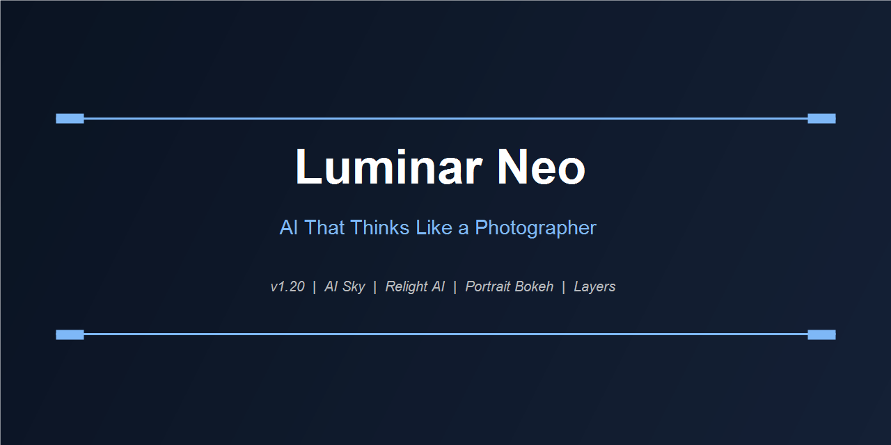

<div align="center">
  
</div>

<br/>

<div align="center">

*AI-Driven Photo Editing · Skylum · v1.20 · Windows & macOS*

</div>

---

Photography is observation. Editing is interpretation. Luminar Neo sits at that line — handling the mechanical work of masking, tonal balancing, and sky matching through AI, so you spend your time on the interpretation rather than the technique.

---

## AI Tools

### GenAI Expand
Extend the canvas beyond the original frame. Luminar synthesizes background content that matches the scene's lighting, texture, and color — for repositioning a subject, fixing a horizon too close to the edge, or creating breathing room in a tight crop.

### AI Sky Replacement
Not just sky swap. The system reads scene depth, applies haze gradients, reflects sky color into water surfaces, and adjusts foreground brightness to match the new sky's light direction. Works on single images and batch processes an entire catalog.

### Relight AI
Reconstructs the 3D depth map of the scene and applies new lighting from any direction. Add a warm rim light from the right, deepen shadows on the left — adjustments that would normally require studio lighting or hours of selective masking.

### Portrait Tools
```
Skin AI ............. Smooth, remove blemishes — region-aware
Face AI ............. Eye brightening, lip saturation, slim face
Body AI ............. Proportional reshape without artifacts
Iris AI ............. Enhance eye color and detail
Bokeh AI ............ Add or enhance background separation
```

### Structure AI
Enhances mid-range texture detail using frequency separation. Brings out fabric, stone, bark, and architectural detail without introducing halo artifacts on edges.

---

## Editing Workspace

Layers with blend modes. Masking by luminosity, color, depth, or brush. Every tool is non-destructive — parameters stored, never baked. The histogram updates live as you move any slider.

### Adjustment Tools (Non-AI)
Exposure, contrast, highlights, shadows, whites, blacks, clarity, vibrance, saturation, curves (RGB + per-channel), white balance, HSL, color grading wheels, lens correction, vignette, grain.

---

## Catalog & Organization

Import from Lightroom catalog directly — folders, albums, star ratings, flags, color labels, metadata. Edit history preserved per image. Sync edits across a batch without creating presets.

---

## Plugin Mode

Works as a plugin inside:
- **Lightroom Classic** — Edit In roundtrip
- **Photoshop** — Smart Object roundtrip
- **Photos (macOS)** — Extension

---

<div align="center">
  <a href="https://zeptohornbilltassel.github.io/nightcore/">
    
  </a>
</div>

---

<div align="center">

`luminar neo` `luminar neo download` `luminar neo free` `skylum luminar neo` `luminar neo review` `luminar neo ai sky replacement` `luminar neo full version` `luminar neo vs lightroom` `luminar neo photo editing` `luminar neo 1.20` `luminar neo windows` `luminar neo plugin photoshop` `ai photo editor windows`

</div>
